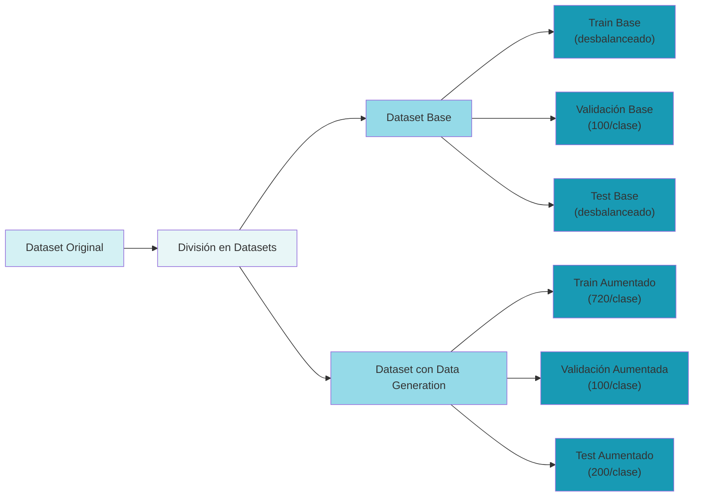

# Car Classification using a CNN 🚗

---

# Índice

# Objetivo

Desarrollar  un modelo de aprendizaje automático, Deep Learning, capaz de clasificar imagenes de diferentes marcas de carros utilizados en Redes Neuronales Convolucionales (CNN).

# Selección del DataSet

El DataSet seleccionado es [**Car Images Classification using CNN](https://www.kaggle.com/code/kshitij192/car-images-classification-using-cnn/notebook),** de Kaggle. 
La estructura del DataSet es la siguiente:

```jsx
Cars Dataset
├── test
│   ├── Audi (199 imágenes)
│   ├── Hyundai Creta (67 imágenes)
│   ├── Mahindra Scorpio (75 imágenes)
│   ├── Rolls Royce (74 imágenes)
│   ├── Swift (102 imágenes)
│   ├── Tata Safari (106 imágenes)
│   └── Toyota Innova (190 imágenes)
|
└── train
    ├── Audi (814 imágenes)
    ├── Hyundai Creta (271 imágenes)
    ├── Mahindra Scorpio (316 imágenes)
    ├── Rolls Royce (311 imágenes)
    ├── Swift (424 imágenes)
    ├── Tata Safari (441 imágenes)
    └── Toyota Innova (775 imágenes)
```

Las imágenes del DataSet tienen una dimensión de **128x128 pixéles.**

## División del DataSet

El dataset se dividió en dos variantes: el Dataset Base y el Dataset con Data Generation. Para cada variante, se realizó la siguiente distribución para asegurar un entrenamiento efectivo y una evaluación confiable del modelo:

| Conjunto | Cantidad de Imágenes por Clase | Porcentaje Aproximado |
| --- | --- | --- |
| Entrenamiento (Train) | 720 | 70% |
| Validación (Validation) | 100 | 10% |
| Prueba (Test) | 200 | 20% |

Para visualizar mejor la estructura y el flujo de ambos datasets, se presenta el siguiente diagrama:



Para manejar el desbalance inicial en el dataset, donde algunas clases tenían significativamente más muestras que otras, se crearon dos variantes: un Dataset Base y otro con técnicas de aumento de datos (Data Generation). Se equilibraron las clases a aproximadamente 820 imágenes por clase, separando 100 imágenes para validación y dejando 720 para entrenamiento efectivo.

## Técnicas de Aumento de Datos y Preprocesamiento

Para mejorar la robustez y capacidad de generalización del modelo, se implementaron diversas técnicas de aumento de datos. Estas transformaciones permiten crear variaciones sintéticas de las imágenes originales, expandiendo efectivamente el conjunto de datos de entrenamiento.

### Transformaciones Implementadas

<aside>
**Normalización y Preprocesamiento**

- **Reescalamiento:** Normalización de píxeles al rango [0, 1], facilitando el procesamiento y convergencia del modelo al estandarizar los valores de entrada.
</aside>

<aside>
**Transformaciones Geométricas**

- **Rotación (10°):** Gira las imágenes aleatoriamente, ayudando al modelo a reconocer objetos en diferentes ángulos.
- **Desplazamiento (10%):** Mueve la imagen horizontal y verticalmente, simulando objetos en diferentes posiciones dentro del marco.
- **Cizalladura o Shear (0.25):** Distorsiona la imagen para simular cambios en la perspectiva de visualización.
- **Zoom (30%):** Acerca o aleja la imagen, permitiendo que el modelo aprenda a reconocer objetos a diferentes escalas.
- **Volteo horizontal:** Invierte la imagen horizontalmente, útil para reconocer objetos independientemente de su orientación.
</aside>

### Implementación

```python
train_datagen = ImageDataGenerator(
    rescale=1./255,          # Normalización
    rotation_range=10,       # Rotación aleatoria
    width_shift_range=0.1,   # Desplazamiento horizontal
    height_shift_range=0.1,  # Desplazamiento vertical
    shear_range=0.25,       # Cizalladura o Shear
    zoom_range=0.3,         # Zoom aleatorio
    horizontal_flip=True     # Volteo horizontal
)
```

Estas transformaciones se aplican de manera aleatoria durante el entrenamiento, lo que ayuda a:

- Prevenir el sobreajuste (overfitting)
- Mejorar la generalización del modelo
- Aumentar la diversidad del conjunto de datos
- Hacer el modelo más robusto ante variaciones en las imágenes de entrada

# Métricas

Para evaluar el rendimiento del modelo de clasificación, se utilizan las siguientes métricas:

| Métrica | Descripción | Importancia |
| --- | --- | --- |
| **Accuracy** | Proporción de predicciones correctas sobre el total de predicciones | Útil para tener una visión general del rendimiento, pero puede ser engañosa en datasets desbalanceados |
| **Precision** | De todas las predicciones positivas, cuántas fueron correctas | Importante cuando queremos minimizar falsos positivos (alta confiabilidad en predicciones positivas) |
| **Recall** | De todos los casos realmente positivos, cuántos fueron identificados correctamente | Crucial cuando queremos minimizar falsos negativos (no perder casos positivos reales) |
| **F1-Score** | Media armónica entre precisión y recall | Proporciona un balance entre precisión y recall, especialmente útil en datasets desbalanceados |

Estas métricas son particularmente relevantes para nuestro caso de clasificación de vehículos porque:

- Tenemos un dataset desbalanceado (diferentes cantidades de imágenes por clase)
- Necesitamos evaluar el rendimiento por clase individual
- Es importante tanto identificar correctamente los vehículos (precision) como no perder clasificaciones correctas (recall)

# Primer Modelo

---

## Construcción del Primer Modelo

### Arquitectura CNN Básica

Una Red Neuronal Convolucional (CNN) básica típicamente consiste en una serie de capas organizadas secuencialmente. Cada capa cumple una función específica en el proceso de extracción y procesamiento de características de las imágenes.


Figura 2. Modelo básico de una Red Neuronal Convolucional.

<aside>

Los componentes principales de una CNN básica incluyen:

- **Capas Convolucionales:** Extraen características de las imágenes mediante filtros que detectan patrones específicos.
- **Capas de Pooling:** Reducen la dimensionalidad de los mapas de características mientras mantienen la información más relevante.
- **Capa de Aplanamiento:** Convierte los mapas de características en un vector unidimensional.
- **Capas Densas:** Procesan las características extraídas para realizar la clasificación final.
</aside>

### Arquitectura Implementada

Para este proyecto, se utilizó como punto de partida la arquitectura propuesta en el notebook de Kaggle "Car Images Classification using CNN". Esta arquitectura sirve como base para nuestro primer modelo y nos permitirá establecer un rendimiento inicial de referencia.

```python
# Arquitectura del modelo base
model_kaggle = models.Sequential([
    # Primera capa convolucional
    Conv2D(32, (3, 3), input_shape=(IMG_SIZE, IMG_SIZE, 3), activation='relu'),
    MaxPooling2D(pool_size=(2, 2)),
    
    # Segunda capa convolucional
    Conv2D(32, (3, 3), activation='relu'),
    MaxPooling2D(pool_size=(2, 2)),
    
    # Aplanamiento y capas densas
    Flatten(),
    Dense(96, activation='relu'),
    Dropout(0.40),
    Dense(32, activation='relu'),
    Dense(7, activation='softmax')  # Capa de salida para 7 clases
])
```

La arquitectura del primer modelo consiste en:

- **Capas Convolucionales:** Dos bloques de convolución, cada uno con 32 filtros y kernel de 3x3, usando activación ReLU
- **Capas de Pooling:** MaxPooling2D después de cada capa convolucional para reducir dimensionalidad
- **Capas Densas:**
    - Primera capa densa con 96 unidades
    - Capa de dropout (40%) para prevenir overfitting
    - Segunda capa densa con 32 unidades
    - Capa de salida con 7 unidades (una por clase) y activación softmax

### Funciones de Activación

### ReLU (Rectified Linear Unit)

ReLU es una función de activación no lineal que se utiliza comúnmente en las capas convolucionales y densas. Su funcionamiento es simple pero efectivo:

- Para valores de entrada negativos, la salida es 0
- Para valores de entrada positivos, la salida es igual al valor de entrada

Matemáticamente se expresa como: f(x) = max(0,x)

Ventajas principales de ReLU:

- Reduce el problema del desvanecimiento del gradiente
- Computacionalmente eficiente
- Permite un entrenamiento más rápido de redes profundas


Figura 3. Función de Activación ReLu en gráfica.

### Softmax

Softmax es una función de activación utilizada en la capa de salida para problemas de clasificación multiclase. Sus características principales son:

- Convierte las salidas en probabilidades que suman 1
- Asigna probabilidades más altas a los valores más grandes de entrada
- Permite interpretar la confianza del modelo en cada predicción


Figura 4. Función de Activación SoftMax en una gráfica.

## Compilación del Primer Modelo

Para la compilación del modelo se utilizaron los siguientes parámetros:

- **Optimizer:** Adam - Un optimizador adaptativo que ajusta automáticamente las tasas de aprendizaje durante el entrenamiento.
- **Loss Function:** Categorical Crossentropy - Función de pérdida adecuada para problemas de clasificación multiclase.
- **Metric:** Accuracy - Para medir la proporción de predicciones correctas durante el entrenamiento.

```python
model.compile(
    optimizer='adam',
    loss='categorical_crossentropy',
    metrics=['accuracy']
)
```

## Análisis de Resultados

Basándonos en los resultados del segundo modelo, podemos realizar el siguiente análisis:

### Rendimiento General

El modelo alcanzó una precisión global (accuracy) del 69%, la cual se toma como la linea base para la mejora del modelo en la segunda iteración y al momdento de balancear el DataSet.

### Análisis por Clase

- **Mejor desempeño:** Toyota Innova (F1-Score: 0.78) indicando una mejor capacidad de identificación de características. Al igual Audi (F1-Score: 0.73) y Tata Safari (F1-Score: 0.77) alzcanzaron un buen desempeño.
- **Balance en métricas:** Existe un desbalance entre las clases, principalmente por la cantidad de imagenes en el dataset para cada clase. Sabemos que Audi y Toyota eran las que tienen mayor cantidad de imagenes. Por lo tanto hay un Bias hacia estas dos clases.

### Análisis de Gráficas

- Tanto la gráfica de Loss como de Accuracy nos muestran un Overfitting por parte del modelo. Como se mencionó anteriormente, el desbalance en la cantidad de fotos para cada clase puede ser un indicador clave de que el modelo confunda Rolls Royce, Hyundai o Mahindra Scorpio con Audi o Toyotas debido a que no ha visto más de estas dos últimas clases mencionadas.

| Clase | Precisión | Recall | F1-Score | Support |
| --- | --- | --- | --- | --- |
| Audi | 0.61 | 0.91 | 0.73 | 199 |
| Hyundai Creta | 0.70 | 0.24 | 0.36 | 67 |
| Mahindra Scorpio | 0.73 | 0.43 | 0.54 | 75 |
| Rolls Royce | 0.57 | 0.27 | 0.37 | 74 |
| Swift | 0.72 | 0.67 | 0.69 | 102 |
| Tata Safari | 0.77 | 0.77 | 0.77 | 106 |
| Toyota Innova | 0.73 | 0.83 | 0.78 | 190 |
| Accuracy |  |  | **0.69** | **813** |
| Macro Avg | 0.69 | 0.59 | 0.61 | 813 |
| Weighted Avg | 0.69 | 0.69 | 0.66 | 813 |

`Test Accuracy: 0.6851`


Figura 5. Matriz de Confusión del Modelo Base.


FIgura 6. Gráfica de Accuracy vs. Epocas del Modelo Base. Se observa un overfitting por parte del modelo.


FIgura 7. Gráfica de Loss vs. Epocas del Modelo Base.

## Conclusiones iniciales

El análisis del modelo base revela importantes hallazgos sobre su rendimiento. En primer lugar, se observa un claro problema de sobreajuste (overfitting) durante el entrenamiento, evidenciado por la divergencia entre el rendimiento en datos de entrenamiento y validación.

La causa principal de este comportamiento radica en el desbalance del conjunto de datos. Las clases mayoritarias como Audi y Toyota Innova, con aproximadamente 200 imágenes cada una, dominan el aprendizaje del modelo. Esto se refleja en sus altos F1-Scores (0.73 y 0.78 respectivamente), mientras que clases minoritarias como Rolls Royce, con menos muestras, obtienen métricas significativamente inferiores (F1-Score de 0.37).

Este desbalance tiene un impacto directo en la capacidad del modelo para generalizar, resultando en un sesgo hacia las clases con mayor representación. Los resultados enfatizan la necesidad crítica de implementar técnicas de balanceo de datos para mejorar el rendimiento global del modelo y asegurar una clasificación más equitativa entre todas las categorías de vehículos.

# Segundo Modelo

Para el segundo modelo la arquitectura que se usa proviene de la publicación *“An Optimized Architecture of Image Classification Using Convolutional Neural Network”* . Propone que con esta configuración de capas se utiliza menos memoria al momento de entrenar el modelo sin sacrificar la eficiencia del mismo en la clasificación de imagenes. 

# Arquitectura Optimizada

La arquitectura optimizada del segundo modelo presenta las siguientes características principales:

- **Capas Convolucionales más profundas:**
    - Primera capa: 16 filtros (3x3) con activación ReLU
    - Segunda capa: 32 filtros (3x3) con activación ReLU
    - Tercera capa: 64 filtros (3x3) con activación ReLU
    - Cuarta capa: 128 filtros (3x3) con activación ReLU
- **Regularización mejorada:**
    - Restricción de norma máxima (max_norm) en todas las capas convolucionales
    - Dos capas de Dropout: una al 20% después de la tercera capa convolucional y otra al 50% antes de la capa densa final
- **Capa densa ampliada:** Una capa densa de 512 unidades antes de la capa de salida, proporcionando mayor capacidad de aprendizaje
- **MaxPooling:** Capas de MaxPooling (2x2) después de cada capa convolucional para reducir dimensionalidad

Esta arquitectura más profunda y regularizada busca mejorar la capacidad de extracción de características y prevenir el sobreajuste observado en el primer modelo.

```python
img_shape = (IMG_SIZE, IMG_SIZE, 3)
model_optimized = models.Sequential()

model_optimized.add(Conv2D(16,(3, 3),activation="relu", kernel_constraint=max_norm(3), input_shape=img_shape))
model_optimized.add(MaxPooling2D((2, 2)))

model_optimized.add(Conv2D(32, (3, 3),activation="relu", kernel_constraint=max_norm(3), input_shape=img_shape))
model_optimized.add(MaxPooling2D((2, 2)))

model_optimized.add(Conv2D(64, (3, 3),activation="relu", kernel_constraint=max_norm(3)))
model_optimized.add(MaxPooling2D((2, 2)))

model_optimized.add(Dropout(0.2))

model_optimized.add(Conv2D(128, (3, 3), activation="relu", kernel_constraint=max_norm(3)))
model_optimized.add(MaxPooling2D((2, 2)))

model_optimized.add(Flatten())

model_optimized.add(Dropout(0.5))
model_optimized.add(Dense(512, activation='relu'))
model_optimized.add(Dense(7, activation='softmax'))

model_optimized.summary()
```

En la parte de compilamiento del modelo al igual que la evaluación se mantiene sin cambios.

## Análisis de Resultados

| Class | Precision | Recall | F1-Score | Support |
| --- | --- | --- | --- | --- |
| Audi | 0.78 | 0.91 | 0.84 | 199 |
| Hyundai Creta | 0.68 | 0.76 | 0.72 | 67 |
| Mahindra Scorpio | 0.81 | 0.89 | 0.85 | 75 |
| Rolls Royce | 0.77 | 0.58 | 0.66 | 74 |
| Swift | 0.90 | 0.80 | 0.85 | 102 |
| Tata Safari | 0.92 | 0.79 | 0.85 | 106 |
| Toyota Innova | 0.94 | 0.91 | 0.92 | 190 |
| **Accuracy** |  |  | 0.84 | 813 |
| **Macro Avg** | 0.83 | 0.81 | 0.81 | 813 |
| **Weighted Avg** | 0.84 | 0.84 | 0.84 | 813 |

`Test Acurracy: 0.8388`


Figura 8. Matríz de Confusión del Modelo Optimizado


Figura 9. Gráfica de Accuracy vs. Epocas del Modelo Optimizado.


Figura 10. Gráfica de Loss vs. Epocas del Modelo Optimizado.

## Conclusiones del Segundo Modelo

El análisis del segundo modelo revela mejoras significativas en el rendimiento general de la clasificación. La comparación de métricas entre el modelo base y el optimizado muestra un incremento sustancial en el F1-Score promedio, pasando de 0.61 a 0.81, lo que representa una mejora del 33% en la capacidad de clasificación.

Las clases que inicialmente presentaban un rendimiento inferior mostraron mejoras notables. Por ejemplo, Hyundai Creta incrementó su F1-Score de 0.36 a 0.72, mientras que Rolls Royce mejoró de 0.37 a 0.66. La precisión general del modelo también experimentó un aumento considerable, elevándose de 0.69 a 0.84.

Sin embargo, como se evidencia en las Figuras 9 y 10, que muestran las gráficas de precisión y pérdida respectivamente, persiste un ligero sobreajuste, aunque menos pronunciado que en el modelo base. Esto indica que, a pesar de las mejoras significativas en la arquitectura optimizada, existe potencial para futuras optimizaciones en términos de regularización y capacidad de generalización.

# Métricas con el DataSet Aumentado

---

Tras realizar el análisis inicial con el Dataset Base (desbalanceado), se procedió a implementar técnicas de aumentación de datos para crear un Dataset Balanceado. Este proceso tuvo como objetivo principal equilibrar la representación de cada clase de vehículo, estableciendo 720 imágenes por categoría en el conjunto de entrenamiento (train) y 200 imágenes por categoría en el conjunto de prueba (test).

La aumentación de datos se realizó mediante las mismas transformaciones mencionadas al inicio del reporte, preservando las características esenciales de los vehículos mientras se introducen variaciones controladas.

A continuación, se presentan los resultados obtenidos al entrenar tanto el Modelo Base como el Modelo Optimizado utilizando este Dataset Balanceado. Este análisis comparativo nos permitirá evaluar el impacto de la aumentación de datos en la reducción del sesgo y la mejora en la capacidad de generalización de ambos modelos.

## Resultados Primer Modelo (Augmented)

| Clase | Precision | Recall | F1-Score | Support |
| --- | --- | --- | --- | --- |
| Audi | 0.50 | 0.90 | 0.65 | 200 |
| Hyundai Creta | 0.80 | 0.47 | 0.59 | 200 |
| Mahindra Scorpio | 0.68 | 0.56 | 0.62 | 200 |
| Rolls Royce | 0.60 | 0.47 | 0.53 | 200 |
| Swift | 0.75 | 0.58 | 0.66 | 200 |
| Tata Safari | 0.78 | 0.73 | 0.76 | 200 |
| Toyota Innova | 0.60 | 0.80 | 0.68 | 200 |
| Accuracy |  |  | 0.64 | 1400 |
| Macro Avg | 0.67 | 0.64 | 0.64 | 1400 |
| Weighted Avg | 0.67 | 0.64 | 0.64 | 1400 |

`Test Accuracy: 0.6435`


Figura 11. Matríz de Confusión del Modelo Base con DataSet Balanceado (Augmented).


Figura 12. Gráfica de Accuracy vs. Epocas del Modelo Base con DataSet Balanceado (Augmented).


Figura 13. Gráfica de Loss vs. Epocas del Modelo Base con DataSet Balanceado (Augmented).

### Análisis del Primer Modelo (Augmented)

La evaluación del primer modelo con el dataset aumentado revela transformaciones interesantes en su desempeño. A primera vista, la precisión general alcanzó un 64.35%, representando una ligera reducción respecto al modelo base original que logró un 69%.

- **Distribución equilibrada:** Un cambio notable es la nueva distribución uniforme del dataset, que ahora cuenta con 200 imágenes por categoría, eliminando el sesgo presente en la versión anterior.
- **Rendimiento por marca:** El comportamiento específico por fabricante muestra patrones interesantes:
    - Los vehículos Audi destacan con un excelente recall de 0.90, aunque su precisión se situó en 0.50
    - Hyundai Creta experimentó una notable mejora en precisión, alcanzando 0.80
    - La marca Tata Safari mantiene su solidez con un F1-Score de 0.76
- **Evolución del aprendizaje:** Las visualizaciones de pérdida y precisión evidencian un mejor control del sobreajuste, sugiriendo que la aumentación de datos fortaleció la capacidad de generalización del modelo.

En conjunto, estos hallazgos sugieren que la estrategia de aumentación de datos, si bien introdujo mayor complejidad en la tarea de clasificación, contribuyó a crear un modelo más robusto y equilibrado, aunque con un pequeño sacrificio en la precisión global.

## Resultado Segundo Modelo (Augmented)

| Class | Precision | Recall | F1-Score | Support |
| --- | --- | --- | --- | --- |
| Audi | 0.67 | 0.91 | 0.77 | 200 |
| Hyundai Creta | 0.93 | 0.68 | 0.78 | 200 |
| Mahindra Scorpio | 0.84 | 0.84 | 0.84 | 200 |
| Rolls Royce | 0.81 | 0.62 | 0.71 | 200 |
| Swift | 0.89 | 0.85 | 0.87 | 200 |
| Tata Safari | 0.87 | 0.91 | 0.89 | 200 |
| Toyota Innova | 0.79 | 0.93 | 0.85 | 200 |
| Accuracy |  |  | 0.82 | 1400 |
| Macro Avg | 0.83 | 0.82 | 0.82 | 1400 |
| Weighted Avg | 0.83 | 0.82 | 0.82 | 1400 |

`Test Accuracy: 0.8178`


Figura 14. Matríz de Confusión Modelo Optimizado (Augmented)


Figura 15. Gráfica Accuracy vs. Epocas Modelo Optimizado (Augmented)


Figura 16. Gráfica Loss vs. Epocas Modelo Optimizado (Augmented)

### Análisis del Segundo Modelo (Augmented)

El análisis del segundo modelo con el dataset aumentado muestra resultados notablemente positivos, alcanzando una precisión general del 81.78%, lo cual representa una mejora significativa respecto al primer modelo aumentado (64.35%). Este rendimiento se mantiene cercano al modelo optimizado original (83.88%), demostrando la robustez de la arquitectura mejorada incluso con un conjunto de datos más desafiante y equilibrado.

- **Mejoras específicas por marca:**
    - Tata Safari mantiene un excelente desempeño con un F1-Score de 0.89
    - Swift muestra un rendimiento sobresaliente con un F1-Score de 0.87
    - Mahindra Scorpio y Toyota Innova presentan métricas muy equilibradas con F1-Scores de 0.84 y 0.85 respectivamente
- **Comparación con el modelo optimizado original:**
    - La precisión general se mantiene similar (81.78% vs 83.88%)
    - Las métricas por clase muestran mayor consistencia y equilibrio
    - El modelo demuestra mejor capacidad de generalización con el dataset balanceado

Las gráficas de entrenamiento muestran un comportamiento más estable y controlado, con menor evidencia de sobreajuste en comparación con las versiones anteriores. Esto sugiere que la combinación de la arquitectura optimizada con el dataset aumentado ha resultado en un modelo más robusto y confiable para la clasificación de vehículos.

# Conclusiones Finales

El análisis exhaustivo de los modelos implementados ha revelado conclusiones significativas que demuestran la evolución y mejora en el proceso de clasificación de vehículos:

- **Optimización arquitectónica exitosa:** La reestructuración del modelo resultó determinante, evidenciada por un incremento sustancial en la precisión, pasando del 64.35% al 81.78% en el dataset aumentado. Este avance subraya la importancia crítica de una arquitectura cuidadosamente optimizada.
- **Beneficios del balance de datos:** La implementación del dataset balanceado, aunque implicó una modesta disminución en la precisión global, generó beneficios sustanciales:
    - Distribución equitativa entre clases (200 imágenes por categoría)
    - Minimización significativa del sesgo clasificatorio
    - Incremento notable en la capacidad de generalización
- **Logros métricos sobresalientes:**
    - Mejora consistente del F1-Score en todas las categorías
    - Rendimiento excepcional en Tata Safari (0.89), Swift (0.87) y Toyota Innova (0.85)
    - Armonización notable entre precisión y recall en el espectro completo de categorías

Para potenciar aún más el rendimiento del modelo, se proponen las siguientes recomendaciones estratégicas:

- **Optimización mediante ponderación de clases:** Incorporar class weights para gestionar eficientemente los desequilibrios residuales en categorías subrepresentadas.
- **Técnicas sofisticadas de aumentación:** Integrar metodologías avanzadas como:
    - Mixup: Fusión estratégica de imágenes para generar muestras enriquecidas
    - CutMix: Técnicas de segmentación y combinación selectiva de elementos visuales
    - Políticas de aumentación dinámicamente adaptativas
- **Innovación arquitectónica:**
    - Implementación de modelos pre-entrenados de última generación
    - Desarrollo de sistemas de ensemble learning robustos
    - Exploración de arquitecturas especializadas en reconocimiento vehicular
- **Refinamiento de hiperparámetros:** Aplicación de metodologías avanzadas como Optimización Bayesiana o búsqueda en cuadrícula para maximizar la eficiencia paramétrica.

La implementación de estas mejoras propuestas tiene el potencial de elevar significativamente el desempeño del modelo actual, particularmente en escenarios de alta complejidad o requisitos específicos de clasificación.

# Referencias

[1] M. Aamir et al, "An Optimized Architecture of Image Classification Using Convolutional Neural Network," International Journal of Image, Graphics and Signal Processing, vol. 10, (10), pp. 30, 2019. Available: [https://www.proquest.com/scholarly-journals/optimized-architecture-image-classification-using/docview/2350539949/se-2](https://www.proquest.com/scholarly-journals/optimized-architecture-image-classification-using/docview/2350539949/se-2). DOI: [https://doi.org/10.5815/ijigsp.2019.10.05](https://doi.org/10.5815/ijigsp.2019.10.05).

[2] A. Manna et al, "Bird Image Classification using Convolutional Neural Network Transfer Learning Architectures," International Journal of Advanced Computer Science and Applications, vol. 14, (3), 2023. Available: [https://www.proquest.com/scholarly-journals/bird-image-classification-using-convolutional/docview/2807222514/se-2](https://www.proquest.com/scholarly-journals/bird-image-classification-using-convolutional/docview/2807222514/se-2). DOI: [https://doi.org/10.14569/IJACSA.2023.0140397](https://doi.org/10.14569/IJACSA.2023.0140397).

[3] K. Kshitij, “Car Image Classification using CNN”. Kaggle. 2022 Available: [Car Images classification using CNN](https://www.kaggle.com/code/kshitij192/car-images-classification-using-cnn/notebook).
